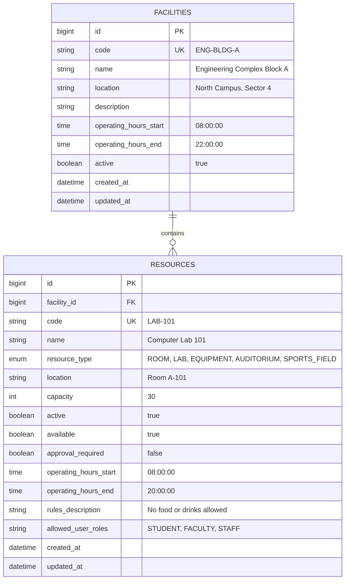

# Facility Resource Service

**University Services Management Platform — Group 6: Facilities and Reservations**  
**Role:** Backend Developer 1

---

## 1. Overview & Architecture

The `facility-resource-service` is an independent Spring Boot 3 microservice responsible for managing campus facilities (buildings, sectors) and master resources (labs, lecture halls, study pods, sports fields, equipment). It provides core domain models, operating hours validation, capacity bounds, availability management, and dedicated validation APIs consumed by `reservation-service` and neighboring groups (Group 7 & Group 8).

### Microservice Isolation Principles:
1. Owns its own MySQL database schema (`facility_db`).
2. Does NOT share direct database access with `reservation-service`.
3. Exposes RESTful APIs and DTO contracts for cross-service validation.

---

## 2. Facility Resource ERD (USMG6-87)



---

## 3. Technology Stack

- **Java:** 17
- **Framework:** Spring Boot 3.3.4 (Spring Web REST, Spring Data JPA, Spring Security, Bean Validation)
- **Database:** MySQL 8.0 (Production / Dev), H2 In-Memory (Automated Testing)
- **API Documentation:** OpenAPI 3.0 / Swagger UI (springdoc-openapi-starter-webmvc-ui 2.6.0)
- **Testing:** JUnit 5, Mockito, Spring Security Test, Spring Boot Starter Test
- **Containerization:** Docker & Docker Compose

---

## 4. REST API Documentation (USMG6-100)

### Facility APIs (`/api/facilities`)
- `GET /api/facilities` — List all facilities (`?activeOnly=true|false`)
- `GET /api/facilities/{id}` — Get facility by ID
- `GET /api/facilities/code/{code}` — Get facility by unique code
- `POST /api/facilities` — Create a new facility
- `PUT /api/facilities/{id}` — Update facility details
- `PATCH /api/facilities/{id}/status?active=true` — Activate / deactivate facility
- `DELETE /api/facilities/{id}` — Soft delete facility

### Resource APIs (`/api/resources`)
- `GET /api/resources` — Search & filter resources (`?facilityId=1&resourceType=LAB&minCapacity=20&active=true&available=true`)
- `GET /api/resources/types` — List all supported resource types
- `GET /api/resources/{id}` — Get resource by ID
- `GET /api/resources/code/{code}` — Get resource by code
- `GET /api/resources/facility/{facilityId}` — Get all resources in a facility
- `POST /api/resources` — Create a new resource
- `PUT /api/resources/{id}` — Update resource details
- `PATCH /api/resources/{id}/status?active=true` — Activate / deactivate resource
- `PATCH /api/resources/{id}/availability?available=true` — Toggle resource availability status
- `PATCH /api/resources/{id}/approval-requirement?required=true` — Toggle approval required flag
- `DELETE /api/resources/{id}` — Deactivate resource

### Cross-Service Validation & Eligibility APIs (USMG6-29, USMG6-32, USMG6-65, USMG6-66)
- `GET /api/resources/{id}/validate` — Cross-service validation (existence, active state, availability, operating hours, capacity)
- `GET /api/resources/code/{code}/validate` — Validation by code
- `POST /api/resources/check-availability` — Full date/time/capacity/role availability & eligibility check
- `GET /api/resources/{id}/validate/group7` — Validation contract for Group 7
- `GET /api/resources/{id}/validate/group8` — Validation contract for Group 8
- `POST /api/resources/validate-batch` — Batch resource validation

---

## 5. Running the Application

### Prerequisites
- Java 17 JDK
- Docker Desktop (for MySQL containerization)

### Local Development (with H2 / Maven):
```powershell
# Run unit and integration tests
.\mvnw.cmd test

# Run application locally
.\mvnw.cmd spring-boot:run
```

### Docker Deployment:
```powershell
# Build and run containers (MySQL + Spring Boot Service)
docker-compose up --build
```

Access Swagger UI at: `http://localhost:8081/swagger-ui.html`
